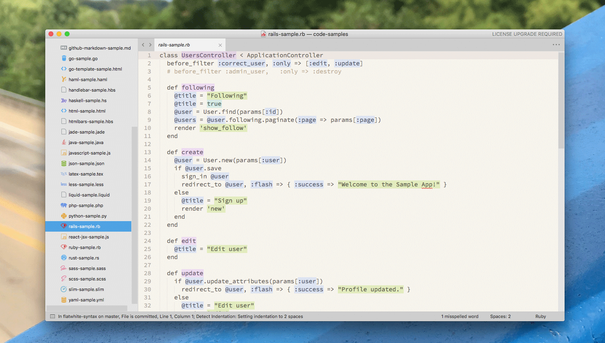

# FlatWhite

A port of [Flatwhite-syntax](https://github.com/biletskyy/flatwhite-syntax) for Sublime Text 3.

> Minimal light syntax theme. 5 colored backgrounds used for code highlighting.

## Samples
*CSS*

*Javascript*

*Ruby on Rails*

